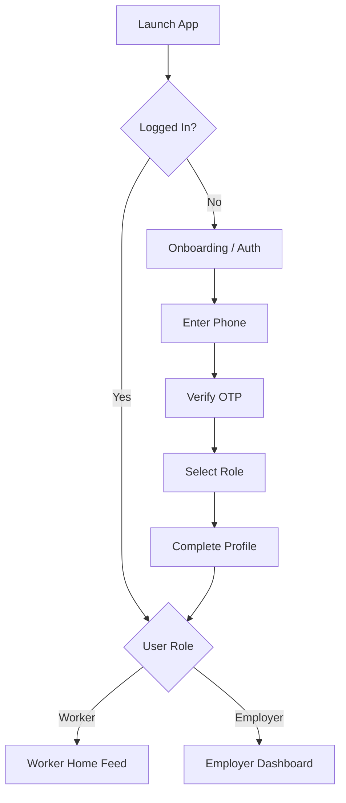
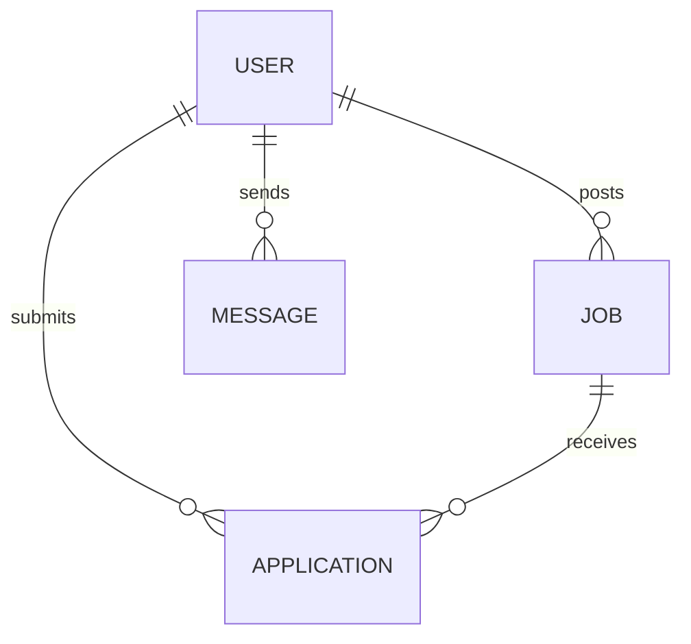

# LaborLink Product Requirements Document (Phase 1 MVP)

[TOC]

## 1. Executive Summary
LaborLink is a premium, mobile-first platform connecting blue-collar and unorganized workforce talent in India with individuals, businesses, and contractors. Phase 1 (MVP) focuses on the core matchmaking journey: enabling workers to find jobs easily, and employers to hire verified talent seamlessly. The MVP intentionally omits advanced features (payments, AI, social) to ensure an ultra-simplified, fast, and high-trust experience tailored for users with low digital literacy.

## 2. Vision
To become the most trusted, ubiquitous digital platform for India's blue-collar workforce, bridging the gap between demand and skilled/unskilled labor through technology that feels human, premium, and accessible.

## 3. Mission
To empower every worker with access to fair opportunities and empower every employer with reliable talent, by removing friction from the hiring process through a dead-simple, highly optimized mobile experience.

## 4. Goals
- **Product Goal**: Launch a stable, fast, and easy-to-use MVP within 3 months.
- **Business Goal**: Achieve high liquidity in target hyperlocal markets (match rate > 40%).
- **User Goal**: Enable a worker to apply for a job in under 60 seconds from app launch.

## 5. Success Metrics
- **Acquisition**: # of Worker and Employer Sign-ups per week.
- **Activation**: % of users completing their profiles.
- **Engagement**: WAU / MAU ratio, average sessions per week.
- **Core Conversion**: % of Job Posts that receive at least 1 application within 24 hrs; % of applications that lead to a "Hire" or "Chat".
- **Performance**: App launch time < 2s, Time to Interactive < 1s.

## 6. Target Audience
- **Workers**: Plumbers, electricians, carpenters, painters, drivers, maids, construction workers, etc. Low digital literacy, predominantly Hindi/regional language speakers, first-time smartphone users.
- **Employers**: Homeowners, local contractors, SME business owners, facility management companies. Moderate to high digital literacy, time-poor, values reliability.

## 7. User Personas
- **Ramesh (35, Electrician)**: Has 10 years of experience but relies on word-of-mouth. Uses WhatsApp and YouTube on his Android phone. Needs a steady stream of jobs nearby. Needs a very simple UI with voice/iconography support.
- **Sanjay (42, Local Contractor)**: Regularly needs 5-10 painters or helpers for projects. Currently struggles with unreliable middle-men. Needs to post jobs quickly and hire fast. Values trust and verified profiles.

## 8. User Problems
- **Workers**: Lack of steady income, exploitation by middlemen, inability to discover jobs outside their immediate physical network.
- **Employers**: High no-show rates, difficulty finding verified talent on short notice, time-consuming negotiation and vetting process.

## 9. Product Scope
LaborLink is a two-sided marketplace. The scope involves a mobile application (React Native for iOS and Android) and a backend system.

## 10. Phase 1 Scope (MVP) Breakdown
Phase 1 is divided into 5 professional development cycles:
- **Phase 1.1 → Foundation**: Branding, Design System, Navigation, Splash, Permissions, Authentication, Onboarding.
- **Phase 1.2 → Worker Experience**: Job discovery, application.
- **Phase 1.3 → Employer Experience**: Job posting, applicant management.
- **Phase 1.4 → Backend Integration & Security**: Real APIs, robust security.
- **Phase 1.5 → Polish, Performance, Testing & Production Readiness**.

### Phase 1.1 Scope (Foundation)
This phase builds the foundation that every future feature will use.
- **Project Setup**: React Native CLI (TypeScript), clean architecture, ESLint + Prettier.
- **Design System & Branding**: Royal Blue (#2563EB) primary, Inter font, soft shadows, large tap targets. Reusable components (Primary Button, Input Field, Bottom Sheet, etc.).
- **Navigation**: Structured stacks (Auth, Main, Modal) for scalability.
- **Splash Screen**: Animated logo, silent auth check.
- **Permissions**: Contextual (Location only).
- **Localization**: English and Hindi selection.
- **Authentication**: Google Sign-In, Email/Password via robust `AuthService`. (Phone number placeholder).
- **Onboarding**: Multi-step flow collecting Name, Photo, Occupation, Skills, Experience, City, Availability, Language.

## 11. Out of Scope (For MVP)
- In-app payments, escrow, or payroll.
- AI matching or recommendations.
- Insurance, financial services, or wallets.
- Social feeds, stories, reels, community forums.
- Complex rating/review systems (basic thumbs up/down can be deferred to Phase 2).
- Multilingual support beyond English/Hindi (to be expanded later).

---

## DESIGN SYSTEM & PRINCIPLES

## 12. UX Principles
- **One Task per Screen**: Do not overwhelm the user. 
- **Forgiving & Reversible**: Users will make mistakes. Make it easy to go back.
- **Recognize over Recall**: Use universal icons and images; avoid text-heavy lists.
- **Feedback Loops**: Instant visual and haptic feedback for every action.
- **No Dead Ends**: Always provide a clear next step (Empty states must have CTAs).

## 13. UI Principles
- **Premium yet Accessible**: Aesthetically clean, avoiding the "cheap/cluttered" look of typical job portals.
- **Spacious**: High whitespace, large tap targets (minimum 48x48 dp).
- **High Contrast**: Ensure readability outdoors under sunlight.
- **Progressive Disclosure**: Show only the information needed right now.

## 14. Complete Design Language
- **Inspiration**: Premium, clean, minimalist. No template look.
- **Corner Radius**: Cards 20px, Buttons 18px, Inputs 16px, Bottom Sheet 28px, Dialog 24px.
- **Shadows**: Very soft, modern, Apple-like. No heavy elevation.

## 15. Color Palette
- **Primary**: Royal Blue `#2563EB`
- **Primary Dark**: `#1D4ED8`
- **Background**: `#FAFBFC`
- **Surface**: `#FFFFFF`
- **Secondary Background**: `#F5F7FA`
- **Divider**: `#E5E7EB`
- **Success**: `#22C55E`
- **Warning**: `#F59E0B`
- **Error**: `#EF4444`
- **Text Primary**: `#111827`
- **Text Secondary**: `#6B7280`
- **Icons**: `#374151`

## 16. Typography
- **Font Family**: `Inter` or `Roboto` (Clean, legible, supports multiple weights beautifully).
- **Hierarchy**:
  - H1 (Header): 28px, Bold, tight tracking.
  - H2 (Subheader): 20px, Semi-Bold.
  - Body 1: 16px, Regular, 150% line height.
  - Body 2 (Secondary): 14px, Medium (used for tags, metadata).
  - Button Text: 16px, Semi-Bold.

## 17. Iconography
- **Style**: Line icons, 2px stroke, rounded terminals. Filled versions for active states (e.g., active tab in Bottom Navigation).
- **Sizes**: 24x24 for standard icons, 32x32 for empty state illustrations.
- Must be universally recognizable (e.g., House for Home, Magnifying glass for Search, Briefcase for Jobs).

## 18. Illustration Style
- **Abstract & Minimal**: Avoid complex scenes. Use abstract geometric shapes paired with human elements.
- **Tone**: Optimistic, helpful, professional.
- **Use cases**: Empty states, success screens, onboarding.

## 19. Motion Design Principles
- **Purposeful**: Motion should guide the eye or confirm an action, never just for decoration.
- **Swift**: Animations must feel fast and snappy (under 300ms).
- **Spatial**: Screen transitions should reflect spatial relationships (e.g., bottom sheets slide up).

## 20. Animation Guidelines
- **Screen Transitions**: Standard horizontal push for deep links; vertical slide-up for modals.
- **Spring Physics**: Use spring animations (slight bounce) for modals and bottom sheets to feel organic.
- **Duration**: Micro-interactions (toggles, buttons) = 150ms. Screen transitions = 250-300ms.

## 21. Micro Interactions
- **Button Press**: Scale down slightly (0.97) on press down, scale back to 1.0 on release.
- **Favorite/Save**: Heart icon scales up and pulses with a slight burst particle effect.
- **Form Focus**: Input border color transitions to Primary Blue; label floats up smoothly.

## 22. Haptic Feedback Guidelines
- **Light Impact**: Button taps, tab switches.
- **Medium Impact**: Successful job application, job posted.
- **Heavy Impact**: Errors, destructive actions (e.g., delete job post).

## 23. Accessibility Guidelines
- **Color Contrast**: WCAG 2.1 AA compliant (minimum 4.5:1 for normal text).
- **Tap Targets**: Minimum 48x48 pixels for all interactive elements.
- **Screen Readers**: Meaningful `accessibilityLabel` for all icons and images.
- **Dynamic Type**: Support OS-level font size scaling without breaking layout.

---

## ARCHITECTURE & NAVIGATION

## 24. Navigation System
- **Bottom Navigation Bar**: Main anchor for the app.
- **Top App Bar**: Contextual actions, title, back button, profile access.
- **Bottom Sheets**: Used for contextual selections (e.g., filtering, choosing a skill) without losing context of the underlying screen.

## 25. Information Architecture
- **Worker App**:
  - Home (Job Feed, Recommended Jobs)
  - Applications (Applied, Hired status)
  - Chat (Messages with Employers)
  - Profile (Settings, Edit Profile)
- **Employer App**:
  - Dashboard (Active Jobs, Quick Post)
  - Candidates (Applicants per job)
  - Chat (Messages with Workers)
  - Profile (Company Info, Settings)

## 26. Complete User Flows


## 27. Worker Journey
- Open App -> Enter Phone -> OTP -> Select "I want to work" -> Enter Name & Primary Skill -> Land on Home Feed -> See jobs near me -> Tap job -> View details -> Tap "Apply Now" -> See Success Modal -> Employer messages -> Chat to negotiate -> Hired.

## 28. Employer Journey
- Open App -> Enter Phone -> OTP -> Select "I want to hire" -> Enter Name & Company -> Land on Dashboard -> Tap "Post a Job" -> Fill 3 simple steps (What, Where, How much) -> Publish -> Receive notifications of applicants -> View applicant profile -> Chat -> Hire.

---

## FEATURE REQUIREMENTS

## 29. Authentication Flow
- **Goal**: Frictionless entry. No passwords.
- **Components**: Phone number input with country code prefix, 6-digit OTP input.
- **Validation**: Ensure phone number is valid length. Auto-read OTP (Android).
- **Error State**: "Invalid OTP", "Network error. Try again."

## 30. Onboarding Flow
- **Goal**: Capture minimum viable data to show relevant content.
- **Steps**:
  1. Role selection (Worker/Employer). Visual cards.
  2. Basic Info (Name, Profile Pic).
  3. Location permission prompt (critical for hyperlocal matching).
  4. (For Workers) Select primary skill (Visual grid of trades).

## 31. Home Screen Requirements (Worker)
- **Header**: "Hello, Ramesh!", Location pill, Notification bell.
- **Search Bar**: Prominent, sticky.
- **Categories**: Horizontal scrolling chips (e.g., Plumbing, Electrical, Helper).
- **Job Feed**: Vertical list of job cards.
- **Job Card**: Job Title, Company Name, Location (distance in km), Pay (e.g., ₹500/day), "Apply" button.

## 32. Search Requirements
- **Functionality**: Full-text search for job titles and skills.
- **Filters**: Bottom sheet for Pay Range, Distance, Job Type (Full-time, Contract, Daily).
- **Empty State**: "No jobs found. Try adjusting your filters." + "Clear Filters" CTA.

## 33. Job Details Requirements
- **Hero Image/Map**: Visual context of the job location.
- **Key Info Banner**: Pay, Timing, Distance.
- **Description**: Expandable text block.
- **Employer Info**: Brief card showing employer name and verification badge.
- **Sticky CTA**: "Apply Now" bottom bar, always visible.

## 34. Apply Job Flow
- **Action**: Tap "Apply Now" -> Checks profile completeness -> If complete, one-tap apply.
- **Animation**: Success checkmark overlay, haptic feedback.
- **Post-Apply**: CTA changes to "Applied", adds a button to "Message Employer".

## 35. Employer Dashboard Requirements
- **Header**: "Welcome back, Sanjay".
- **Primary CTA**: Large, prominent "Post a New Job" card.
- **Active Jobs List**: Summary of open jobs with applicant count badges.

## 36. Create Job Flow
- **Step 1: The Job**: Title, Category, Number of workers needed.
- **Step 2: The Details**: Pay (Per day/month), Timing, Short description.
- **Step 3: Location**: Auto-detect current or drop pin.
- **Review & Post**: Summary screen. Confetti success animation on post.

## 37. Applicant Management Flow
- **List View**: Applicants for a specific job. Worker card (Photo, Name, Distance, Match %).
- **Actions**: "Chat", "Call", "Reject", "Hire".
- **Hire Action**: Moves worker to "Hired" list, notifies worker.

## 38. Chat Requirements
- **Functionality**: Real-time 1-on-1 text messaging.
- **UI**: Standard chat bubbles (WhatsApp style for familiarity).
- **Features**: Read receipts, online status, timestamp.
- **Safety**: "Report User" option in top menu.

## 39. Notifications
- **Push & In-App**: 
  - Worker: "New job matching your skills near you", "Employer viewed your profile", "New message from Sanjay".
  - Employer: "Ramesh applied to your Painter job", "New message".

## 40. Profile Requirements
- **View**: Editable fields for Name, Phone, Skills, Experience, Bio.
- **Avatar**: Upload photo or use initials placeholder.
- **Trust Elements**: "Phone verified" badge.

## 41. Settings Requirements
- Language Toggle (English/Hindi).
- Notification preferences.
- Privacy policy, Terms of Service.
- Logout, Delete Account.

---

## SYSTEM STATES

## 42. Error States
- **Network Error**: SnackBar at the bottom "No internet connection. Reconnecting..."
- **Form Error**: Inline red text below input, shake animation on input field.
- **Global Error**: Full screen "Something went wrong" with a "Try Again" button.

## 43. Empty States
- Custom abstract illustration, a friendly heading (e.g., "No applicants yet"), a sub-text explanation, and a primary action button (e.g., "Share Job").

## 44. Loading States
- **Initial App Load**: Branded splash screen.
- **Screen Load**: Skeleton loaders matching the exact shape of the content (cards, text lines). Avoid spinners for full-page loads to reduce perceived wait time.
- **Action Load**: Inline spinner on the button (text changes from "Apply" to spinner).

## 45. Offline Behaviour
- Cache the Home Feed and Chat history.
- Show a subtle offline banner.
- Queue actions (like sending a message) and sync when reconnected.

## 46. Permissions
- **Location**: Asked contextually when looking for jobs or posting a job. Clear explanation text before the OS prompt.
- **Camera/Storage**: Asked only when the user taps to upload a profile photo.
- **Notifications**: Asked after onboarding completion.

---

## ENGINEERING & ARCHITECTURE

## 47. Security Considerations
- JWT for API authentication.
- Rate limiting on OTP endpoints to prevent SMS pumping.
- HTTPS/TLS for all API calls.
- Sanitize inputs to prevent XSS in Chat and Job Descriptions.
- PII data encryption at rest (phone numbers).

## 48. Performance Goals
- **LCP (Largest Contentful Paint)**: < 2.5s.
- **App Size**: < 30MB (critical for target audience on low-end devices).
- **API Response**: 95th percentile < 200ms.
- **List Scrolling**: 60fps locked using `FlashList` in React Native.

## 49. Backend Requirements
- Stateless RESTful API or GraphQL.
- Real-time engine (WebSockets/Socket.io) for Chat.
- Geospatial querying capability for distance-based job matching.

## 50. API Requirements (Key Endpoints)
- `POST /auth/send-otp`
- `POST /auth/verify-otp`
- `GET /jobs?lat=&lng=&radius=&category=`
- `POST /jobs`
- `POST /jobs/:id/apply`
- `GET /chat/conversations`
- `POST /chat/message`

## 51. Database Collections (NoSQL / Relational)
- **Users**: ID, Role, Phone, Name, Location, Skills, CreatedAt.
- **Jobs**: ID, EmployerID, Title, Category, Location(GeoJSON), Pay, Status.
- **Applications**: ID, JobID, WorkerID, Status (Pending, Accepted, Rejected), AppliedAt.
- **Messages**: ID, ConversationID, SenderID, Text, Timestamp, ReadStatus.

## 52. Data Relationships


## 53. Validation Rules
- Phone: Must be exactly 10 digits (India format).
- Job Pay: Must be > 0.
- Location: Must have valid Lat/Lng.

## 54. Edge Cases
- User denies location permission: Fallback to manual city search/selection.
- Employer deletes a job while a worker is viewing it: Handle with gracefully disabled CTA ("This job is no longer available").
- Deep linking to a non-existent job ID: Redirect to Home with a toast notification.

## 55. Analytics Events
- `App_Opened`
- `Login_Success`
- `Role_Selected` (property: role)
- `Job_Viewed` (property: job_id)
- `Job_Applied` (property: job_id)
- `Job_Posted` (property: job_id)
- `Message_Sent`

## 56. Logging Requirements
- Server-side error logging (e.g., Sentry, Datadog).
- API request latency monitoring.
- Client-side crash reporting (Crashlytics).

## 57. Testing Requirements
- Unit tests for utility functions and core backend logic (Jest).
- E2E tests for the core flows (Apply Job, Post Job) using Detox or Maestro.
- Manual QA focusing on low-end Android devices (e.g., Samsung Galaxy M series, Xiaomi Redmi).

---

## PROJECT STRUCTURE

## 58. Folder Structure Recommendation (React Native)
```
src/
├── api/             # API client and query mutations
├── assets/          # Icons, images, fonts
├── components/      # Reusable UI components (Buttons, Cards, Inputs)
├── navigation/      # React Navigation setup
├── screens/         # Screen components grouped by feature (Auth, Home, Profile)
├── store/           # State management (Zustand or Redux)
├── theme/           # Colors, typography, spacing (Design Tokens)
├── utils/           # Helpers, formatters, constants
└── App.tsx          # Entry point
```

## 59. React Native Architecture Recommendation
- **Framework**: React Native with Expo (Managed Workflow for rapid MVP development).
- **Styling**: Restyle or NativeWind (Tailwind for RN) to maintain strict design system compliance.
- **Navigation**: React Navigation v6.
- **Data Fetching**: React Query for caching, optimistic updates, and loading state management.
- **State Management**: Zustand for global UI state (minimal footprint).
- **Lists**: `@shopify/flash-list` for performant infinite scrolling.

## 60. Backend Architecture Recommendation
- **Runtime**: Node.js with Express or NestJS.
- **Database**: PostgreSQL (with PostGIS for location queries) or MongoDB (with geospatial indexes).
- **Hosting**: AWS ECS / Vercel / Render (optimized for quick MVP deployment).
- **Real-time**: Socket.io or Firebase Cloud Messaging.

---

## EXECUTION

## 61. Development Milestones
- **M1 (Week 1-2)**: Backend scaffold, Auth flow, Database schema. UI Design System implementation.
- **M2 (Week 3-4)**: Job creation and Discovery (Home Feed).
- **M3 (Week 5-6)**: Job application flow, Applicant Management.
- **M4 (Week 7-8)**: Real-time Chat integration.
- **M5 (Week 9-10)**: Notifications, Profile, Polish, Bug Fixes.
- **M6 (Week 11-12)**: Beta testing, UAT, App Store Submission.

## 62. Phase Breakdown
- **Design**: 2 weeks.
- **Frontend App**: 6 weeks.
- **Backend/API**: 4 weeks (concurrent with frontend).
- **QA & Launch**: 2 weeks.

## 63. Risks
- **App Rejection**: App stores may require stricter account deletion or user reporting tools. *Mitigation: Build these flows into MVP.*
- **SMS Costs**: High OTP failure rates leading to cost explosion. *Mitigation: Implement ReCaptcha, rate limit by IP/Device.*
- **Low GPS Accuracy**: Devices in dense urban areas failing to give accurate location. *Mitigation: Allow manual override.*

## 64. Future Expansion (Brief)
- **Phase 2**: Payment gateways for verified advances, ratings and reviews, identity verification (Aadhaar KYC).
- **Phase 3**: Automated escrow, gig attendance tracking, localized language support (Voice interfaces), skills training courses.

---

## SCREEN INVENTORY & COMPONENT SPECIFICATIONS

### Screen: Authentication (Login/Signup)
- **Purpose**: Identify user securely.
- **User Goal**: Enter the app with zero friction.
- **Components**: Logo, Phone Input (country prefix fixed), "Send OTP" Button.
- **Layout**: Centered content, spacious, keyboard-avoiding view.
- **States**: Default, Loading (Spinner on button), Error (Invalid Phone).

### Screen: OTP Verification
- **Purpose**: Verify possession of phone.
- **Components**: 6-digit OTP input boxes, "Verify" button, "Resend OTP in 0:30" timer text.
- **Animations**: Auto-focus next box on type. Shake on incorrect OTP.

### Screen: Role Selection
- **Purpose**: Segment user journey.
- **Components**: Two massive touchable cards. Card 1: "I want to Work" (Briefcase icon). Card 2: "I want to Hire" (Building icon).
- **Micro-interactions**: Card border highlights Primary Blue on tap, proceeds to next screen automatically after 500ms delay.

### Screen: Worker Home Feed
- **Purpose**: Discover relevant jobs instantly.
- **Components**: Top bar (greeting, location, bell), Search input, Category chips (horizontal scroll), Job Cards (vertical FlashList).
- **Empty State**: Illustration of a worker looking around, text: "No jobs matching your skills nearby. Try expanding the search distance."

### Screen: Job Details
- **Purpose**: Convince worker to apply.
- **Components**: Map Header, Title, Tags (Pay, Time), Description text, Employer Card (Avatar, Name, Rating), Sticky Bottom Bar with Primary "Apply Now" Button.
- **Edge Cases**: If already applied, button is disabled and says "Applied".

### Screen: Employer Dashboard
- **Purpose**: Manage active job posts and see new applicants.
- **Components**: "Post Job" primary CTA block. List of "Active Jobs". Each Active Job card shows Title and a Badge with number of New Applicants.
- **Empty State**: Illustration of an empty office, "You haven't posted any jobs yet. Hire someone today!"

### Screen: Chat View
- **Purpose**: Real-time communication.
- **Components**: Chat header (User name, Avatar, Online status), Message bubbles (Left aligned for them, Right aligned for me, Blue/Gray colors), Input bar, Send icon button.
- **Layout**: Message list inverted (latest at bottom). Keyboard-avoiding view.

---

## COMPONENT LIBRARY (DESIGN SYSTEM DETAIL)

- **Buttons**:
  - `PrimaryButton`: Solid Blue fill, White text.
  - `SecondaryButton`: Transparent fill, Blue border, Blue text.
  - `GhostButton`: No border, Gray text (for less important actions).
- **Inputs**:
  - `TextInput`: 12px border radius, 1px solid Gray border. On focus: 2px solid Blue border. Floating label.
- **Cards**:
  - `JobCard`: White surface, subtle shadow. Inner padding 16px. Flex layout for Title and Price.
  - `WorkerCard`: Includes circular Avatar on the left, Name and Match % on right.
- **Badges**:
  - `StatusBadge`: Small pill. Green background for "Hired", Yellow for "Pending", Gray for "Closed".
- **Bottom Sheets**:
  - Handle at the top center (pill shape).
  - Background overlay: Black with 40% opacity.

---
*End of Document. Prepared for LaborLink Engineering and Product Teams.*
